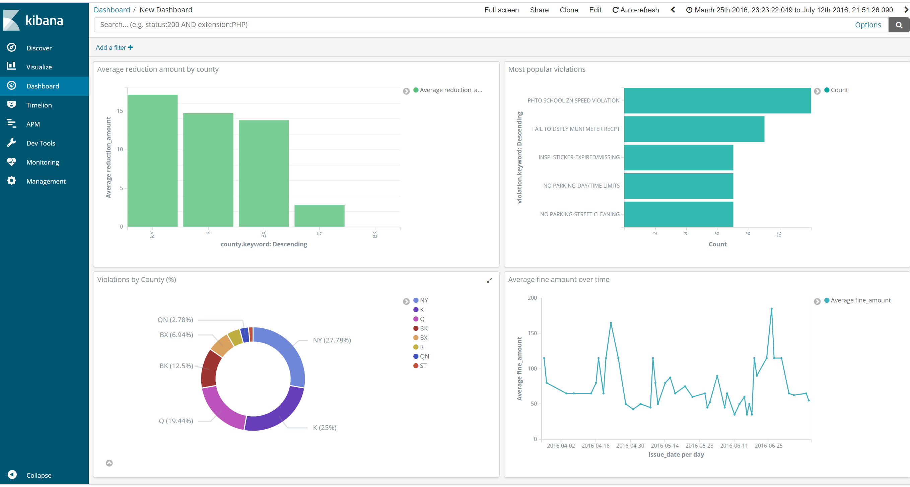

### project1_sta9760 , part 2+3, Andre G
# analyzing millions of NYC parking violations

## overview:
this is python project to analyze millions of NYC parking violations using big data technology tools. The program is a command line interface that communicates with the API of cityofnewyork to collect data from parking violations. It then loads the data to Elasticsearch and Kibana, to create visualizations and dashboards. It can also display the data on screen ,or writes it to a file if requested.

Important! To run this, you will need the Docker Desktop software

## inputs:
--APP_KEY = unique app key from data.cityofnewyork.us, make an account to get your own unique key

--page_size = how many results per pull, or 'page'. this is required

--num_pages = how many pulls to preform. if not provided, program will keep asking for pages until data is depleted

--output = string value for file to output to. type es for elasticsearch. if not provided, output to stdout

## to start
    docker-compose up -d
this will start elasticsearch and kibana

## test that elasticsearch and kibana are running (this might take a couple of minutes):
elasticsearch: http://localhost:9200 Kibana: http://localhost:5601

## to run and send to elasticsearch: 
    docker-compose run -e APP_KEY='YOUR KEY HERE' -v $(pwd):/app pyth python -m main --num_pages=INT_VALUE --page_size=INT_VALUE --output=es
        
## turn off
    docker-compose down

## Kibana:
after you load parking violations into kibana, load the kibana page through the link above. You will be prompted to select the index to work with. select the one that appears: parking-violation-index, and select issue_date as the time field. 
Now, you can create visualizations and even your own live dashboard, that will update every time you load more violations. 

## project part 1 : this uses docker instead of docker-compose, and does not write to elasticsearch

### to build the docker
    docker build -t project1:1.3 .
    
### to print to stdout

    docker run -e APP_KEY='YOUR KEY HERE' -v $(pwd)/app -t project1:1.3 python -m main --num_pages=INT_VALUE --page_size=INT_VALUE

### print to file 

    docker run -e APP_KEY='YOUR KEY HERE' -v $(pwd)/app -t project1:1.3 python -m main --num_pages=INT_VALUE --page_size=INT_VALUE --output='filename.ext'

## print example with 5 pages and 1 result per page

