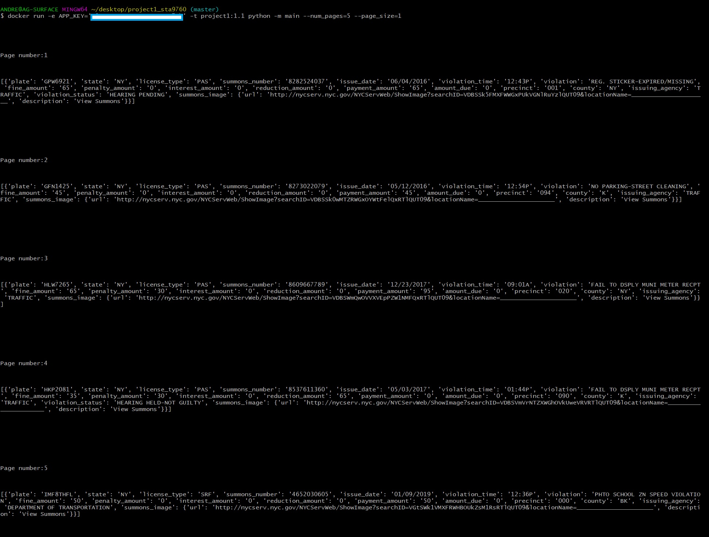

### project1_sta9760 , part 1, Andre G
# analyzing millions of NYC parking violations

## known issue: this program does not seem to be able to print to a file in pcs running a WINDOWS OS as of yet.

## inputs:
--APP_KEY = unique app key from data.cityofnewyork.us, make an account to get your own unique key

--page_size = how many results per pull, or 'page'. this is required

--num_pages = how many pulls to preform. if not provided, program will keep asking for pages until data is depleted

--output = string value for file to output to. if not provided, output to stdout

## For machines not running native unix - add 'winpty' before the docker command

## to build the docker
    docker build -t project1:1.3 .

## to print to stdout
command: 

    docker run -e APP_KEY='YOUR KEY HERE' -v $(pwd)/app -t project1:1.3 python -m main --num_pages=INT_VALUE --page_size=INT_VALUE

## print to file
command: 

    docker run -e APP_KEY='YOUR KEY HERE' -v $(pwd)/app -t project1:1.3 python -m main --num_pages=INT_VALUE --page_size=INT_VALUE --output='filename.ext'

## print example with 5 pages and 1 result per page

